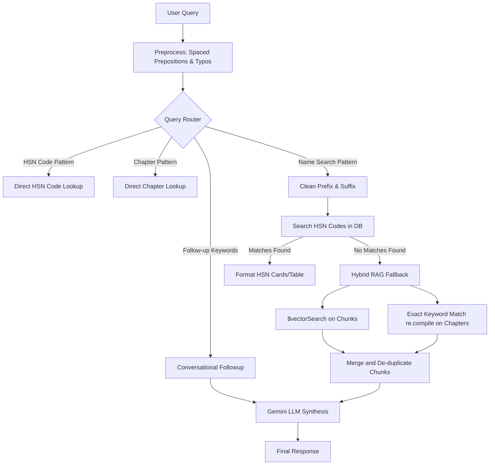

# RegulAI — Codebase Context

RegulAI is a regulatory intelligence chatbot application designed to query the Indian Customs Tariff Schedule, lookup HSN codes, compute import/customs duty rates, and answer questions about policy exemptions or concessions.

---

## 1. Directory Structure

```
regul_ai - Copy/
├── cbic_downloaded_content.txt
├── timepass
└── chat_bot/                      # Main project directory
    ├── .env                       # Environment variables (Mongo URI, Gemini API key)
    ├── .gitignore
    ├── app.py                     # Flask backend entrypoint & server routing
    ├── rag_search.py              # Query preprocessing, routing, and RAG context builders
    ├── embed_pipeline.py          # Sentence-transformers model loader & document embedding
    ├── hsn_extract_pipeline.py    # Pipeline to parse and upload structured HSN data
    ├── test_followups.py          # Integration and regression test suite
    ├── CBIC_ALL_PDFS/             # Folder containing raw chapter PDFs (Chapters 1-98)
    ├── static/                    # Frontend UI assets (HTML, CSS, JS)
    └── requirements.txt           # Python dependency specifications
```

---

## 2. System Architecture

The application uses a Hybrid Retrieval-Augmented Generation (RAG) system:



### 2.1 Database (MongoDB)
- **Database Name**: `regulai`
- **Collections**:
  - `hsn_codes`: Contains structured row mappings of HSN codes to description, unit, standard rate, and preferential rate (for parsed chapters).
  - `notifications`: Holds the metadata and full texts of the Indian Customs Tariff schedule PDFs (each tariff chapter is a document, e.g. `chap-12`).
  - `chunks`: Segmented text chunks generated from the tariff chapters, containing vector embeddings for semantic query matching.

---

## 3. Core Components

### 3.1 Flask Web Server (app.py)
- Starts a Flask application, serving the premium frontend UI under `/static`.
- Implements standard stream reconfigurations on Windows (`sys.stdout.reconfigure(encoding='utf-8')`) to prevent Hugging Face progress emojis from crashing the process in command redirects.
- **Main Chat Endpoint**: `POST /api/chat/mongo`
  - Body: `{"messages": [{"role": "user", "content": "..."}]}`
  - Processes the user conversational messages using `chat_with_context()`.

### 3.2 RAG Preprocessing & Routing (rag_search.py)
- **Spaced Preposition Normalization**: Corrects common spacing typos (e.g. `"o n"` $\rightarrow$ `"on"`, `"o f"` $\rightarrow$ `"of"`, `"f o r"` $\rightarrow$ `"for"`) in user queries.
- **Prefix/Suffix Cleaning**: Removes conversational request wrappers at both the beginning (e.g. `"give me the import duty on"`) and end (e.g. `"give me import duty"`, `"hsn code"`, `"gst rate"`) to isolate clean product names.
- **Word-boundary Constraints**: Matches search terms using compiled regex word boundaries (`\b`) to prevent substring overlaps (e.g., matching `"live"` against `"liver extracts"`).
- **Exact Keyword Fallback**: Atlas `$regex` queries in this MongoDB environment return zero matches due to configuration limitations. Thus, `re.compile(..., re.IGNORECASE)` is used in Python. If semantic search misses a rare keyword (like `"Ajams"` in Chapter 12), the exact match fallback queries the chapter full texts, retrieves the correct chunks, and prepends them to the context block.

### 3.3 Text Embedding (embed_pipeline.py)
- Loads the `BAAI/bge-base-en-v1.5` sentence-transformers embedding model.
- Includes error handling and custom console print configurations to prevent crashes on Windows environments.

---

## 4. How to Run & Verify

### 4.1 Running the Server
The Flask application is run using waitress or directly with python:
```powershell
# Start server cleanly on http://localhost:5000
python -u app.py
```

### 4.2 Running the Integration Tests
The project contains an automated test suite verifying search routing, direct HSN lookups, and conversational follow-ups:
```powershell
python test_followups.py
```
*Note: Make sure port 5000 is listening and the MongoDB cluster is reachable.*
